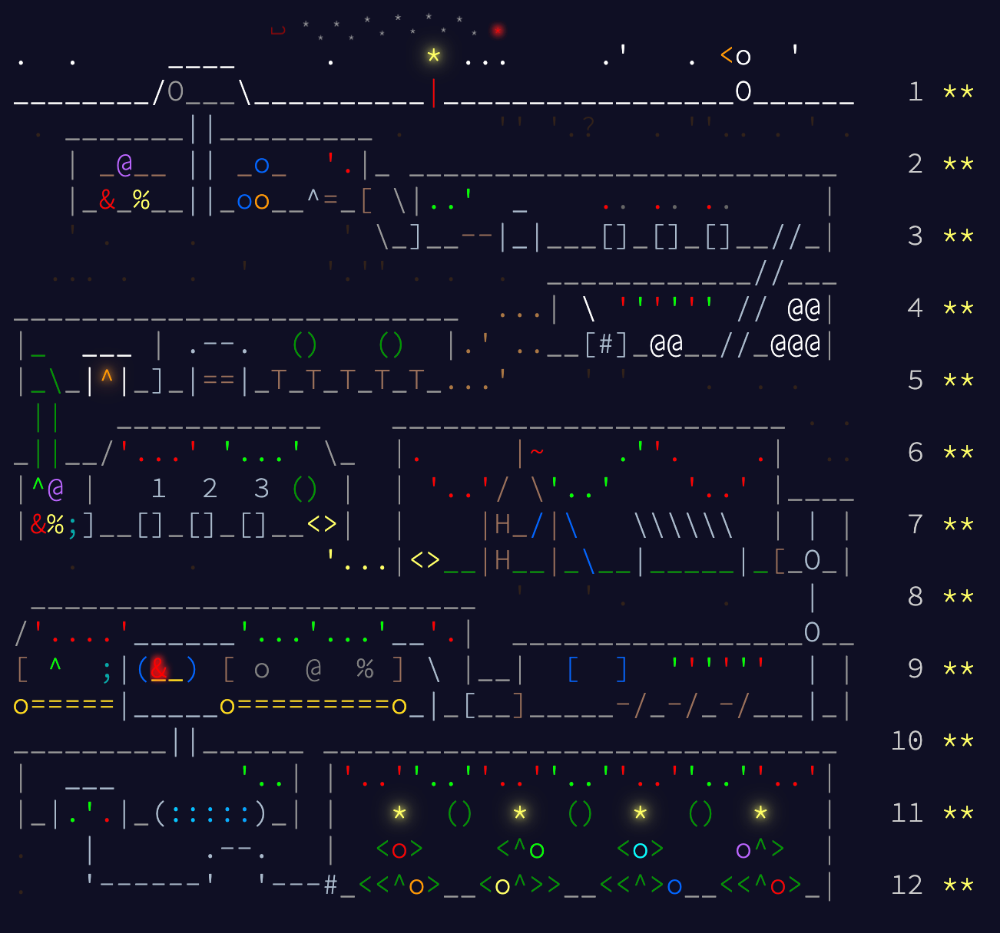

# Advent of code 2025

24/24 stars, cya next year!



## Answers

Run under:

- MacBook Pro 2023 (Apple M2 Pro)
- Rust 1.91.1

```plaintext
Day1:
  Password: 989, Time spent: 72µs
  Password with CLICK: 5941, Time spent: 47µs
Day2:
  Sum of invalid ids: 15873079081, Time spent: 64887µs
  Sum of invalid ids repeated more than twice: 22617871034, Time spent: 35570µs
Day3:
  Largest joltage with 2 batteries: 17435, Time spent: 37µs
  Largest joltage with 12 batteries: 172886048065379, Time spent: 50µs
Day4:
  Accessible points: 1344, Time spent: 199µs
  Accessible points with removal: 8112, Time spent: 3579µs
Day5:
  Fresh ingredients counts: 563, Time spent: 85µs
  All ingredients counts: 338693411431456, Time spent: 14µs
Day6:
  Answer: 4076006202939, Time spent: 118µs
  Answer in correct format: 7903168391557, Time spent: 109µs
Day7:
  Times will laser split: 1590, Time spent: 65µs
  Possible timelines: 20571740188555, Time spent: 33µs
Day8:
  Pruduct of three largest circuits: 330786, Time spent: 9750µs
  Pruduct of x-coord of last 2 junction boxes: 3276581616, Time spent: 12206µs
Day9:
  Largest area: 4750176210, Time spent: 136µs
  Largest inner area: 1574684850, Time spent: 79µs
Day10:
  Fewest press: 494, Time spent: 135640µs
  Fewest press met requirements: 19235, Time spent: 863228µs
Day11:
  Different paths: 791, Time spent: 20µs
  Different paths from svr: 520476725037672, Time spent: 202µs
Day12:
  Regions can fit presents: 505, Time spent: 3µs
```
